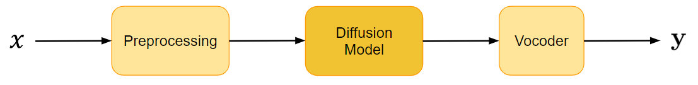
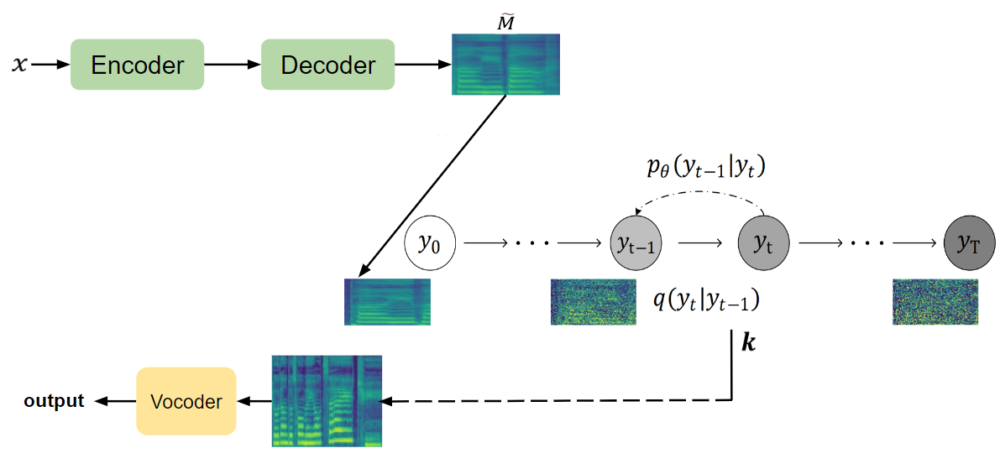

# Transfer of Singing Voice

This system is a **Singing Voice Conversion** system based on shallow diffusion, designed to transfer a singing voice onto a target singer (here, me!) irrespective of the depth of the voice, pitch, language, or accent. 

This system was built in Spring 2023 at Stanford University.

## Audio Demos & Results

I trained my model (I discuss the architecture below) on 40 mins of my own singing voice (not auto-tuned or modified in any way). I demonstrate the results on source-separated vocals from Taylor Swift songs (I'm a big fan of her music!).
The outputs are her songs transferred to my vocals. Click the links below to listen to the comparisons:

*   **You Belong With Me**
    *   [Original (Source Separated Taylor Swift Vocals)](https://drive.google.com/file/d/1CglMi6WYB_b0kDSeRt1aMmJGqv4FUwuc/view?usp=sharing)
    *   [AI Generated (me singing)](https://drive.google.com/file/d/1TMEpLvVbGXfEk84hpfIi3sZ3j2FYh8db/view?usp=sharing)
*   **Champagne Problems**
    *   [Original (Source Separated Taylor Swift Vocals)](https://drive.google.com/file/d/1Pj0csMQHndFGFBvZE7T_fDaWHQGfGVGC/view?usp=sharing)
    *   [AI Generated (me singing)](https://drive.google.com/file/d/1HASB4C0ti9k4h0zClznIqv8mtkliVleA/view?usp=sharing)
*   **Midnight Rain**
    *   [Original (Source Separated Taylor Swift Vocals)](https://drive.google.com/file/d/1z-Rvc0RAIr_tQpB3onr_pojTiIW8KmCu/view?usp=sharing)
    *   [AI Generated (me singing)](https://drive.google.com/file/d/1q-v41W_THIiegyKuf2orD1tKn5r1ePa5/view?usp=sharing)

## Architecture

The pipeline consists of three primary components: a preprocessing module, a shallow diffusion model, and a HiFi-GAN vocoder.

*Figure 1: A high-level block diagram*

### 1. Preprocessing
*   **Audio Slicing**: Raw audio inputs are sliced into 5-second chunks using `audio-slicer`.
*   **MelSpectrogram Extraction**: The sliced audio is converted to a MelSpectrogram. The Mel Scale is selected because it reflects non-linear human pitch perception, emphasizing lower frequencies where humans have higher resolution:
    
    $$m = 2595 \log_{10}\left(1 + \frac{f}{700}\right)$$
    where $f$ is the frequency in Hz.

### 2. Shallow Diffusion Model
Traditional adversarial training models (like GANs and autoencoders with bottleneck layers) often suffer from training instability and loss of resolution due to information bottlenecks. 

Diffusion models resolve these issues by gradually corrupting the input MelSpectrogram with Gaussian noise in the forward process and training a network to reverse this corruption. 

#### Training
During training, the diffusion process operates on the MelSpectrogram ($y_t$) using a Kullback–Leibler (KL) divergence loss at each step:

$$\mathcal{L}_{\text{recon}} = D_{\text{KL}}(q(y_t \mid y_{t-1}) \parallel p_{\theta}(y_{t-1} \mid y_t))$$
$$\mathcal{L}_{\text{total}} = \sum_{t=1}^T \mathcal{L}_t$$

#### Inference & Shallow Diffusion
During inference, a pure noise startup would lose the pitch and melody of the source singer. To prevent this, Shallow Diffusion is used:

1. An auxiliary encoder-decoder setup (trained with L1 loss) generates a preliminary target MelSpectrogram from the source audio features.
2. A classification block (trained with cross-entropy loss) identifies the step $k$ in the forward diffusion process where the ground-truth MelSpectrogram and the reconstructed MelSpectrogram become indistinguishable under noise.
3. The forward process is stopped at step $k$, and the reverse process is initialized from this intermediate noisy state, preserving the underlying musical structure and pitch while mapping the voice texture to the target singer.

*Figure 2: The inference pipeline using shallow diffusion.*

### 3. Vocoder
We use a pre-trained **HiFi-GAN** vocoder to invert the generated target MelSpectrograms back into high-fidelity 44.1kHz raw waveform audio.

## Discussion & Analysis

While the output successfully captures the vocal characteristics of the target singer, several acoustic challenges were observed:
*   **Low-Frequency Distortions ("bhmmm" noise)**: Attributed to phase mismatch during recovery or regions where the frequency spectrum lacked representative training data.
*   **Harmonic Breakdown**: Since the system is designed for monophonic inputs, source-separated tracks with overlapping harmonies (e.g., *Champagne Problems* at 1:40) cause generation glitches.
*   **Microphone Artifacts**: Since the target dataset was recorded on a mobile phone, breath noise ("pfff" plosives) was captured and learned by the model, appearing in the converted outputs.
*   **High-Frequency Oscillations**: Caused by residual instrument bleeding in the source-separated input. These can be mitigated by applying low-pass filters before input and after output.
